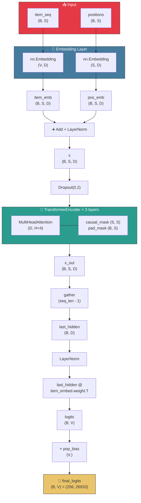
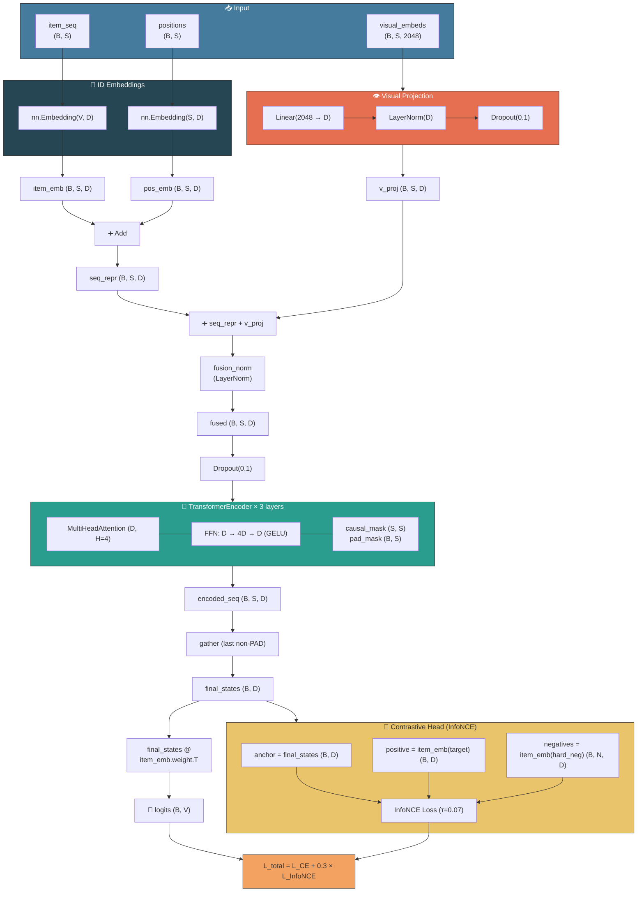
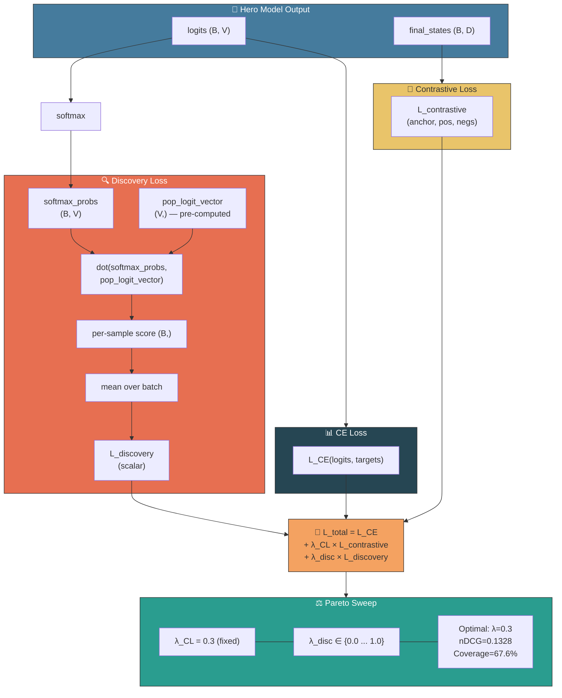

# Architecture Diagrams (Mermaid)

> **How to export as PNG:**
> 1. Go to [mermaid.live](https://mermaid.live)
> 2. Paste a diagram block below into the editor
> 3. Click **Actions → Export PNG** (or SVG)
> 4. Save to `analytics/presentation/`

---

## ACT 1 — VILLAIN: SASRec + Position Bias

---

## ACT 2 — HERO: BST + ResNet50 Visual Fusion + Contrastive

---

## ACT 3 — BRAIN: Multi-Objective Discovery Loss

